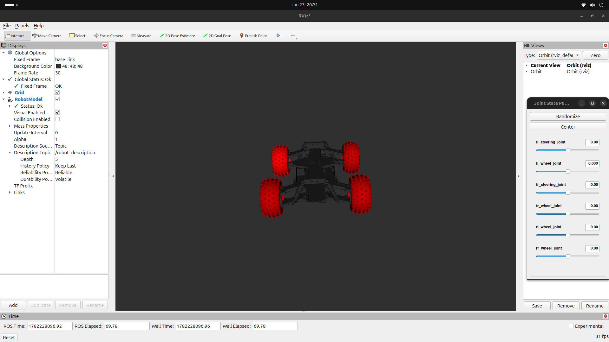

# Autonomous Chassis: Interactive Simulation Workspace

**Role:** R&D Mechatronics Engineer

A functional ROS 2 and Gazebo simulation workspace featuring a custom-designed mechanical chassis equipped with dynamic steering joints, active perception sensors, and physical friction mapping.

**Tech Stack:** ROS 2 (Jazzy), Gazebo (Harmonic), Xacro/URDF, SolidWorks, RViz2, C++, Python
<div align="center">
  
  
  [](https://docs.ros.org/en/jazzy/)
  [](https://gazebosim.org/)
  [](LICENSE)
  [](https://python.org)
</div>

> Custom autonomous mobile robot simulation: from SolidWorks CAD → URDF/Xacro → 
> Gazebo Harmonic physics simulation with live RViz2 sensor streams.

---

## 🎨 Project Media & Results Showcase

The implementation results are divided into physical mechanical design features followed by live runtime robotics environment data.

### 1. 3D Modeling & Kinematic Renders
The chassis, suspension geometries, and steering linkages were designed from scratch to optimize component clearance and realistic center-of-mass distribution.

* **Interactive 3D Asset:** `differential_drive_chassis.glb` (Open directly in any 3D viewer)

<p align="center">
  
  
</p>

### 2. ROS 2 & Gazebo Simulation Output
These assets demonstrate the live tracking environment, verifying that the physical model communicates with the underlying ROS perception topics.

* **Real-Time RC Car Tracking Video:** `Resources/Videos/RC Car on RViz.mp4` (Included in repository files)

<p align="center">
  
  
  <br>
  <em>Figure 2: Active TF coordinate tracking and live sensor streams inside RViz2.</em>
</p>


<p align="center">
  
  
  <br>
  <em>Figure 3: Multi-body physics execution inside the Gazebo Harmonic engine environment.</em>
</p>

---

## 💻 Building & Execution Instructions

Follow this terminal sequence exactly to install dependencies, compile the workspace code, and execute the simulation nodes on your local system.

### System Prerequisites
* **Operating System:** Ubuntu 24.04 LTS
* **ROS 2 Distribution:** Jazzy Jalisco
* **Simulation Engine:** Gazebo Harmonic

Before building, install the required ROS-to-Gazebo environment communication bridges via `apt`:
```bash
sudo apt update
sudo apt install ros-jazzy-ros-gz ros-jazzy-ros-gz-bridge
```


### Workspace Installation Setup
Execute these commands to prepare your local directory structure, download the source code, and run the compilation tools:

```bash
# Initialize a clean ROS 2 workspace environment
mkdir -p ~/ros2_ws/src
cd ~/ros2_ws/src

# Clone the repository source packages
git clone [https://github.com/SivakumarThirumurugan/Autonomous-Chassis.git](https://github.com/SivakumarThirumurugan/Autonomous-Chassis.git)

# Navigate back to workspace root and build the code links
cd ~/ros2_ws
colcon build --symlink-install

# Activate the built workspace environment variables
source install/setup.bash
```
### Launching the Simulation Environment
To start the complete system—which initializes the Gazebo simulation window, runs the robot state publishers, opens the parameter bridge network, and loads your chassis model—run this single launch command:

```bash
ros2 launch autonomous_chassis_gazebo simulation.launch.py
```
### Verifying Results in RViz2
To view the perception data streams shown in the project showcase images, open a separate terminal window, source the workspace, and run:
```bash
source ~/ros2_ws/install/setup.bash
rviz2
```
